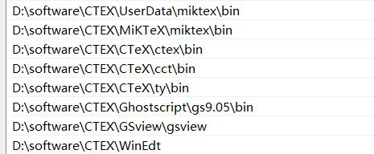
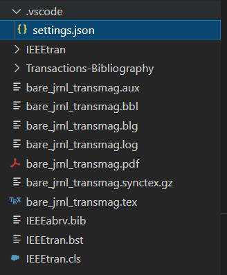

# Vscode中Latex环境配置

## 环境支持
1. Vscode插件 Latex Workshop
2. Latex软件+环境变量配置

## 安装步骤

1. Latex Workshop

很简单，直接在Vscode插件商店中安装即可。

2. Latex软件

我这里选用的是CTex,安装它的具体教程为
https://blog.csdn.net/weixin_39059031/article/details/102978653

按好以后，配置好相应的环境变量,里边这些环境变量最好都配置有，随后环境的安装就算完成了。


## 使用

1. 打开Vscode，在.vscode文件夹中新建.settings.json文件。


2. 随后在settings.json文件加入以下文本:
___
```
{
  "latex-workshop.latex.recipes": [
  {
  "name": "PDFLaTeX",
  "tools": [
  "pdflatex"
  ]
  },
  {
  "name": "PDFLaTeX with Shell Escape",
  "tools": [
  "pdflatex-with-shell-escape"
  ]
  },
  {
  "name": "XeLaTeX",
  "tools": [
  "xelatex"
  ]},
  {
  "name": "XeLaTeX with Shell Escape",
  "tools": [
  "xelatex-with-shell-escape"
  ]
  },
  {
  "name": "PDFLaTeX -> BibTeX -> PDFLaTeX*2",
  "tools": [
  "pdflatex",
  "bibtex",
  "pdflatex",
  "pdflatex"
  ]
  },
  {
  "name": "XeLaTeX -> BibTeX -> XeLaTeX*2",
  "tools": [
  "xelatex",
  "bibtex",
  "xelatex",
  "xelatex"
  ]
  },
  {
  "name": "latexmk",
  "tools": [
  "latexmk"
  ]
  },
  {
  "name": "BibTeX",
  "tools": [
  "bibtex"
  ]
  },
  {
  "name":"MakeIndex",
  "tools":[
  "makeindex"
  ]
  },
  ],
  "latex-workshop.latex.tools": [
  {
  "name": "xelatex",
  "command": "xelatex",
  "args": [
  "-synctex=1",
  "-interaction=nonstopmode",
  "-file-line-error",
  "%DOC%"
  ]
  },
  {
  "name": "xelatex-with-shell-escape",
  "command": "xelatex",
  "args": [
  "--shell-escape",
  "-synctex=1",
  "-interaction=nonstopmode",
  "-file-line-error",
  "%DOC%"
  ]
  },
  {
  "name": "pdflatex",
  "command": "pdflatex",
  "args": [
  "-synctex=1",
  "-interaction=nonstopmode",
  "-file-line-error",
  "%DOC%"
  ]
  },
  {
  "name": "pdflatex-with-shell-escape",
  "command": "pdflatex",
  "args": [
  "--shell-escape",
  "-synctex=1",
  "-interaction=nonstopmode",
  "-file-line-error",
  "%DOC%"
  ]
  },
  {
  "name": "latexmk",
  "command": "latexmk",
  "args": [
  "-synctex=1",
  "-interaction=nonstopmode",
  "-file-line-error",
  "-pdf",
  "%DOC%"
  ]
  },
  {
  "name": "bibtex",
  "command": "bibtex",
  "args": [
  "%DOCFILE%"
  ]
  },
  {
  "name":"makeindex",
  "command":"makeindex",
  "args":["%DOCFILE%"]
  },
  ],
  }
  ```
 ___

 接下来就可以通过新建.tex文件的方式在Vscode中编辑.tex文件了。当然，一般是不推荐自己手写的，更常见的做法是找到对应期刊中提供的模板文件，根据具体的模板文件来做修改。
